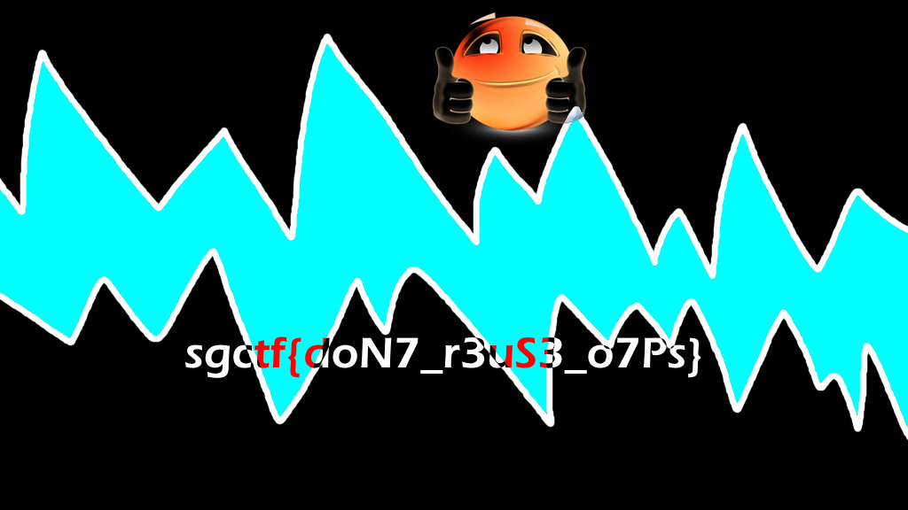

One-Time Pads are a form of encryption that is mathematically proven to be unbreakable if used correctly. However, in this challenge, we are given two images that were encrypted using the same One-Time Pad, which allows us to mount an attack that can recover information from the original images.

Note that One-Time Pads work in the following manner:
- A key is generated that is the same length as the plaintext
- The key is XORed with the plaintext to produce the ciphertext
- As long as the key is truly random and never reused, the encryption is unbreakable
- The key would need to be used both for encryption and decryption

Regarding the OTP reuse, if you have:
- `cipher1 = plaintext1 ⊕ key`
- `cipher2 = plaintext2 ⊕ key`

Then:
- `cipher1 ⊕ cipher2 = plaintext1 ⊕ plaintext2`

We can't fully recover plaintext1 or plaintext2 without additional steps like cryptanalysis or pattern recognition, but it is sufficient in this case to recover the image.

For the actual solution, we can either write a script that allows us to XOR the images (ideally an existing one instead of a custom one), or use an online tool like https://elysiatools.com/en/tools/image-boolean-xor