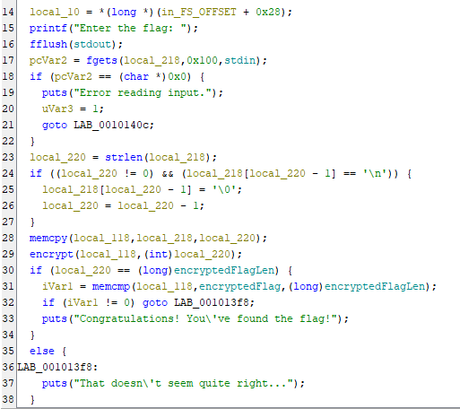
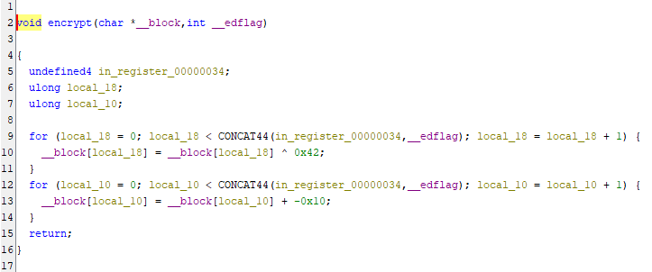
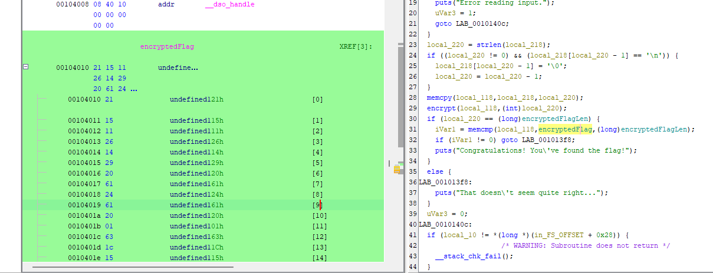

The binary file appears to take in an input and compare it to another value in order to determine if it is the correct flag. Unlike String Cheese (which contains the hardcoded plaintext flag) and Memory Lane (which decrypts the flag to compare it to user input), this binary encrypts user input and compares it to a hardcoded encrypted flag, meaning the flag remains encrypted at all times. As such, we need to reverse engineer the encryption algorithm in order to determine the flag.

Opening the binary, the decompiler shows us the main function:

We can rename some of these variables for clarity, but the emphasis is largely on lines 29 and 31. Here, local_118 is encrypted and then compared to the encryptedFlag. Additional tracing confirms that local_118 is functionally the value of our user input.

Opening the encryption function, we see that it runs the following code on the user input:

Essentially, the encryption function takes each byte of the input, XORs it by a constant of 0x42, then subtracts another constant of 0x10. We can reverse this process to decrypt the flag.

The encryptedFlag is stored at memory address 0x104010, which has the byte array of `21 15 11 26 14 29 20 61 24 61 20 01 63 1c 15 0d 26 fa 61 0d 61 1c f1 20 0b 22 06 1b 62 1c 2f` as seen below:

At this point, we can now write a script to reverse the encryption process and decrypt the flag. We take the above bytestring, add the constant 0x10 to each byte, then XOR each byte by 0x42 to get the original bytes of the flag.