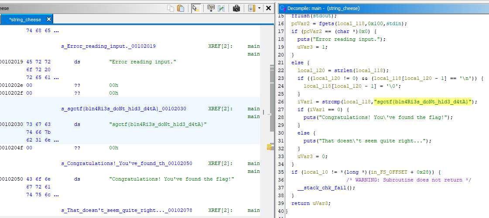

For this challenge, we are given a binary file that takes in an input and compares it to a hardcoded value. However, the hardcoded value is stored in plaintext within the binary file, so we can simply search for it with a tool like `strings` to view the flag. We can also resubmit in the file to verify that it is correct.

Running `strings ./string_cheese | grep sgctf` reveals the flag, though you could also use something like `hexdump -C ./string-cheese` or Ghidra to find it by searching in the data section (pictured below).

